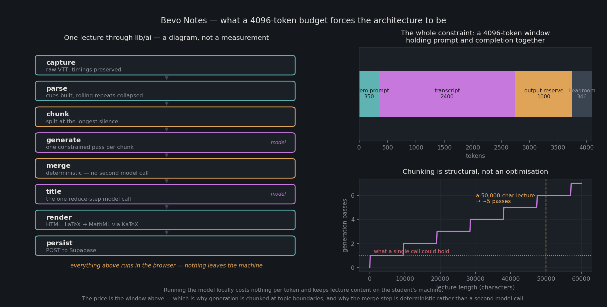

# Bevo Notes

Turns UT Austin lecture captions into structured study notes, flashcards, and
graded practice questions — with **every model call running in the student's
own browser**.

[Watch the demo](https://youtu.be/ThRs32Z1ArQ)

There is no AI service tier, no inference server, and no external model
provider. The platform holds no API keys, pays nothing per token, and never
sends lecture content to a third party. A Chrome extension reads the captions
off UT's lecture-capture player, generates notes locally through WebLLM on the
student's GPU, and syncs the finished notes to a dashboard for organizing,
searching, and exporting.



*The right-hand panels are arithmetic on the documented context budget; the
left is a diagram of `lib/ai/`, not a measurement. Regenerate with
`python3 docs/render_figure.py`.*

## Why in the browser

The obvious build is "POST the transcript to an API, get notes back." That
design has three problems for a student tool: someone pays per token for every
lecture in the university, the lecture content leaves the student's machine,
and the whole thing dies the moment the free credits run out.

Running a quantized Llama 3.2 1B (879 MB) in the browser via WebGPU trades
those away for a one-time download, cached thereafter — about 1.1 GB in total
once the embedding model is included. The cost of the trade is a
**4096-token context window holding prompt and completion together**, which is
the constraint the rest of the architecture is shaped around.

## The context budget

| | tokens |
|---|---|
| System prompt | ~350 |
| Output reserve | ~1000 |
| Transcript per pass | ~2400 (≈9,500 characters) |

A 50,000-character lecture exceeds that window roughly fivefold, so chunking is
structural rather than an optimization. The pipeline:

1. **Capture** — the extension returns raw VTT, so caption timings survive.
2. **Parse** — build timestamped cues and collapse rolling-caption duplicates.
3. **Chunk** — split at the *longest silence* in the tail of each buffer.
   Professors pause at topic transitions, so silence is a free topic boundary;
   fixed-width cuts split derivations down the middle.
4. **Generate** — one constrained-decoding pass per chunk against a fixed JSON
   schema. Passes are independent, so they can't drift.
5. **Merge** — deterministic, not a model call: fold duplicate headings, dedupe
   definitions by normalized term, dedupe key points.
6. **Title** — the single reduce-step model call, run over headings only.
7. **Render** — HTML, with LaTeX converted to MathML through KaTeX.

Step 5 being deterministic matters: a second model pass to "combine these
notes" is the obvious approach and it is exactly what the context budget cannot
afford.

## Study tools

Notes become practice material through a retrieval-augmented pipeline over an
IndexedDB vector store, embedded locally with `snowflake-arctic-embed-s`:

- Generated quizzes and flashcards grounded in the actual lecture, not the
  model's priors
- Free-response grading, also run in-browser
- Search across a course's whole note library

## Architecture

```
Chrome Extension (MV3)                     Browser (Next.js app)
  ├── content.js                             ├── Pages & UI
  │     reads VTT captions                   ├── lib/ai — WebLLM, RAG,
  ├── background.js (service worker)         │     generation, grading
  │     owns offscreen lifecycle             └── IndexedDB vector store
  └── offscreen.js
        ├── WebLLM (WebGPU) ── generation
        └── vendor/bevo-ai.js (bundled lib/ai)
                    │
                    │  save / read only
                    ▼
        Vercel (Next.js App Router)
          └── API routes — persistence only, no inference
                    │
                    ▼
                 Supabase
        (Postgres + Auth + Storage, RLS on)
```

The server tier is deliberately boring. It stores rows and checks sessions; it
never sees a model.

| Layer | Choice |
|---|---|
| Framework | Next.js 16 (App Router), React 19, TypeScript |
| Inference | `@mlc-ai/web-llm` — Llama 3.2 1B Instruct q4f16, SmolLM2 360M on reduced tier |
| Embeddings | `snowflake-arctic-embed-s`, in-browser |
| Chunking | `@langchain/textsplitters` |
| Data | Supabase — Postgres with row-level security, Auth, Storage |
| Auth | Magic link, restricted to `@utexas.edu` |
| Math | KaTeX → MathML |
| Capture | Chrome extension, Manifest V3 |

## Capability tiers

Not every machine can hold the weights. `lib/ai/capability.ts` runs before any
download and returns one of three modes:

| Mode | Model | Trigger |
|---|---|---|
| `full` | Llama-3.2-1B-Instruct, q4f16 (879 MB) | adapter limits ≥ 879 MB |
| `reduced` | SmolLM2-360M-Instruct, q4f16 (376 MB) | adapter limits ≥ 376 MB |
| `readonly` | none | no WebGPU, null adapter, or insufficient limits |

The binding constraint is memory rather than browser support: weights have to
fit in GPU-addressable memory, which on integrated graphics and Apple Silicon
comes out of shared system RAM.

Read-only is a first-class state, not an error. Those users still read,
organize, search, and export — only the generation controls are hidden. There
is no server-side fallback to fall back to, by design.

## Running it

```bash
git clone https://github.com/lucascarsonbrown/bevo-notes.git
cd bevo-notes
npm install
cp .env.example .env.local   # Supabase project URL and anon key
npm run dev
```

Requires a browser with WebGPU (Chrome 113+). The first generation downloads
the model, which takes a few minutes on a normal connection and is cached
afterward.

For the extension: `chrome://extensions` → Developer mode → Load unpacked →
select the extension directory.

## Repo layout

| Path | Contents |
|---|---|
| `app/` | Next.js routes — dashboard, notes, courses, settings, auth |
| `app/api/` | Persistence endpoints only — notes, courses, folders, units, study, usage |
| `lib/ai/` | The interesting half: WebLLM engine, chunking, schema, merge, RAG, vector store, quiz, grading, render |
| `lib/supabase/` | Client/server/middleware Supabase wiring |
| `components/` | Dashboard UI — sidebar, note grid, modals, export |
| `docs/architecture.md` | Full architecture write-up |

## Status

Working end to end and deployed. `MVP_DESIGN.md` is kept for provenance, but
its API-key, cost, and subscription sections predate the move to browser-only
inference — `docs/architecture.md` is the current description.
